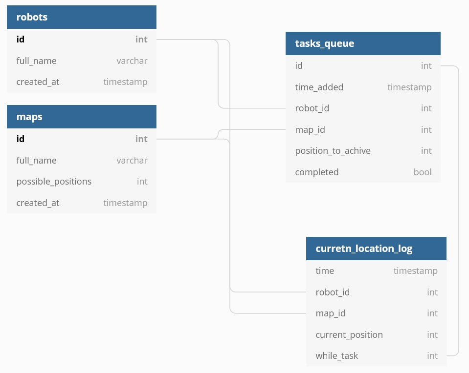

# IPZ_MTR_Robot_pozycjonujacy

Opis projektu
Celem projektu jest zbudowanie i zaprogramowanie robota określającego swoje położenie na powierzchni. Pojazd będzie komunikował się za pomocą sieci wifi z serwerem, z którego będzie pobierana mapa pomieszczenia, w którym się znajduje. Położenie wyznaczane będzie za pomocą 5 czujników ultradźwiękowych, a napęd będzie realizowany przez dwa silniki DC.
Projekt będzie zbudowany na platformie arduino UNO, a komunikacja wifi będzie się odbywała przez moduł ESP32. Czujniki odległosći to HY-SRF05.

Db diagram:

Robot sterowany jest przez stronę internetową połączoną z serwerem, tam mogą być dodawane i usuwane kolejne roboty. Może też zostać zlecone polecenie ustawienie się robota w danym punkcie mapy. Dane mapy opartej na rzeczywistym pomieszczeniu są przesyłane do robobot z bazy SQL. Robot na tej podstawie określa swoje położenie i jest w stanie udać się do wyznaczonego punktu. Urządzenie może być również uruchamiane i wyłączane za pomocą aplikacji na system android, Która łączy się z serwerem, następnie informacja przesyłana jest do robota.

LINK do listy elementów:
https://docs.google.com/spreadsheets/d/1kxy9I-g9Q_NdTyfCT67b4c6HRwbB3Ju5-OLuap8rChM/edit?usp=sharing

